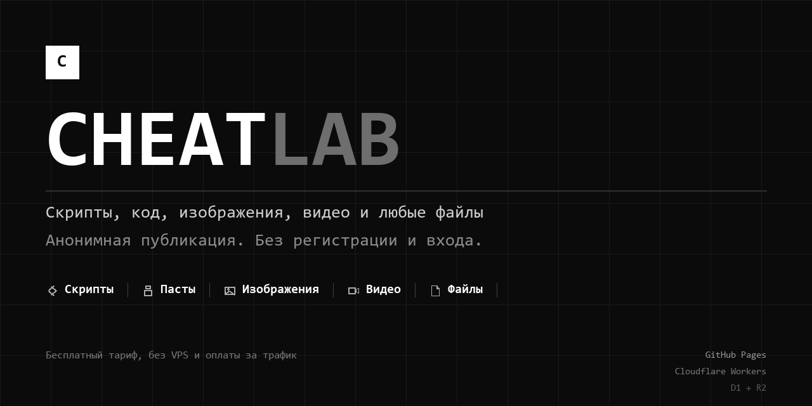

  

# CHEATLAB

Площадка для публикации скриптов, исходников, изображений, видео и файлов.
Работает без рекламы и без тарифов: сайт живёт на GitHub Pages, а API — на
Cloudflare Workers, всё внутри бесплатных лимитов.

Дизайн чёрно-белый: единственный акцент — чёрный, без градиентов, скруглений и
эмодзи, только линейные иконки. По умолчанию тёмная тема.

**Сайт:** <https://tatarhost.github.io/cheatlab/>

## Что на сайте

- Шесть типов публикаций: скрипт, приложение, паста, изображение, видео, файл.
- Лента с поиском, тегами, сортировкой и счётчиком просмотров.
- Галерея: несколько изображений в одной публикации с превью и перемоткой.
- Указание игры Roblox по ID: карточка с названием, студией и обложкой, своя
  страница со всеми публикациями об этой игре.
- Поле «ключевая система» — что нужно запустить, чтобы скрипт заработал.
- Страница публикации: просмотр исходника, медиа, скачивание.
- Видео перематывается без полной загрузки, аудио проигрывается прямо на странице.
- Одинаковые файлы хранятся один раз — повторные загрузки не занимают место.
- «Мои загрузки»: управление своими публикациями, экспорт и импорт ключей доступа.
- Профили авторов: биография, подписки, подписчики и лента публикаций.
- Статистика хранилища.
- Виджет для встраивания публикаций в любые сайты без регистрации.

## Без регистрации

Можно публиковать вообще без аккаунта. При первом визите браузер сам создаёт
идентификатор устройства и хранит его на вашей стороне.

Что разрешено гостям:

- одна публикация в сутки;
- до 5 правок публикации в сутки;
- до 64 МБ на устройство и до 8 МБ на один файл;
- при отправке — простая проверка-вопрос (несложный пример или подсчёт).

Профиля, подписок и личного хранилища без аккаунта нет.

## Регистрация

Аккаунт — это никнейм и пароль. Никакой почты, телефона и верификации: чужие
данные вам не понадобятся.

Что даёт аккаунт:

- 12 публикаций в сутки без проверки-вопроса;
- безлимитные правки публикаций;
- 2 ГБ хранилища и до 50 МБ на один файл; если сервер ещё не подключён к
  Cloudinary, файл всё равно принимается, но ограничен 24 МБ — сайт всегда
  показывает тот предел, который действительно работает;
- профиль с биографией, подписки и список подписчиков.

Пара честных предупреждений:

- Сессия действует в том браузере, где вы вошли. С другого устройства можно
  войти заново по нику и паролю.
- Пароль восстановить нельзя: почты и секретных вопросов не существует. Если
  забыли пароль, аккаунт останется доступным только на устройстве с активным
  входом.
- Ключи редактирования хранятся в браузере. На странице «Мои загрузки» их можно
  экспортировать, чтобы не потерять доступ к публикациям при очистке данных.

## Ограничения и модерация

Защита от злоупотреблений не мешает обычному пользователю: лимиты частоты
запросов, дневные лимиты публикаций, чёрный список расширений и хешей файлов,
проверка-вопрос для гостей.

Доступ не блокируется по стране, IP, VPN или типу подключения — читать и
публиковать можно откуда угодно.

## Что дальше

В разработке или на очереди: лайки и комментарии в интерфейсе
(бэкенд уже готов), группы, каналы и чаты, голосовые публикации, консоль
модерации, более серьёзная человеческая проверка вместо простого вопроса.