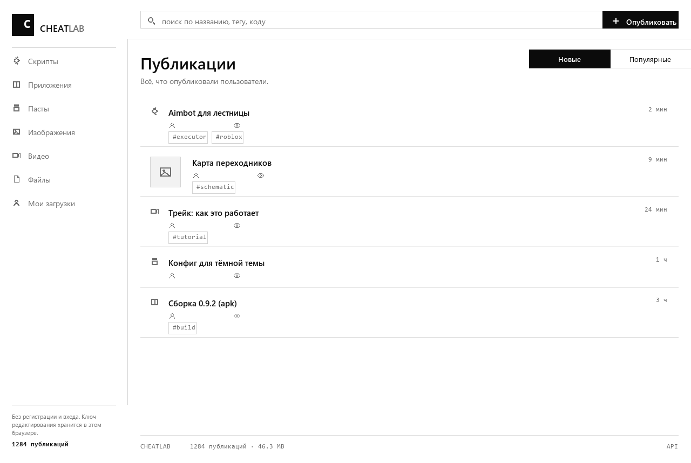
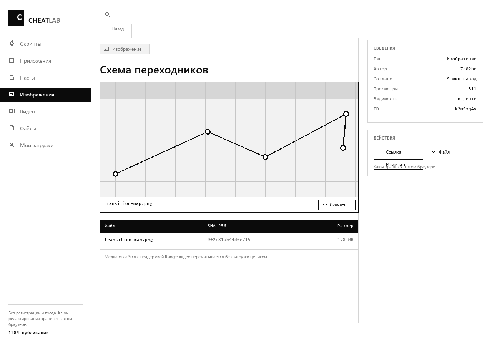
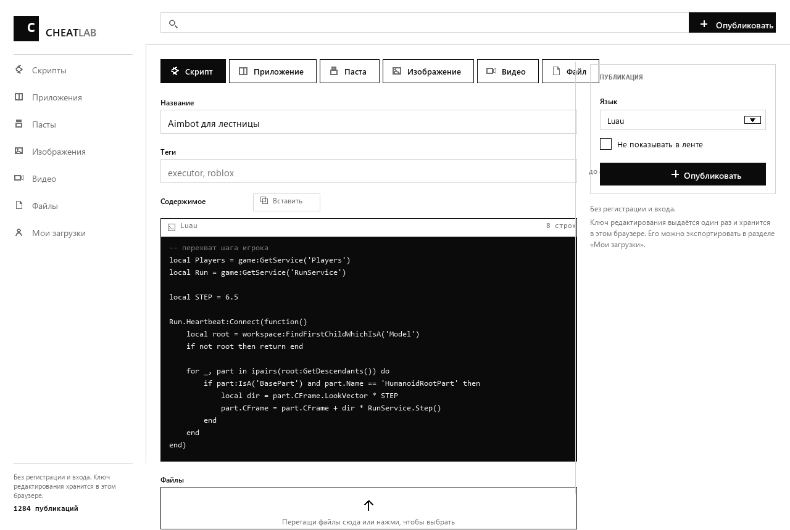
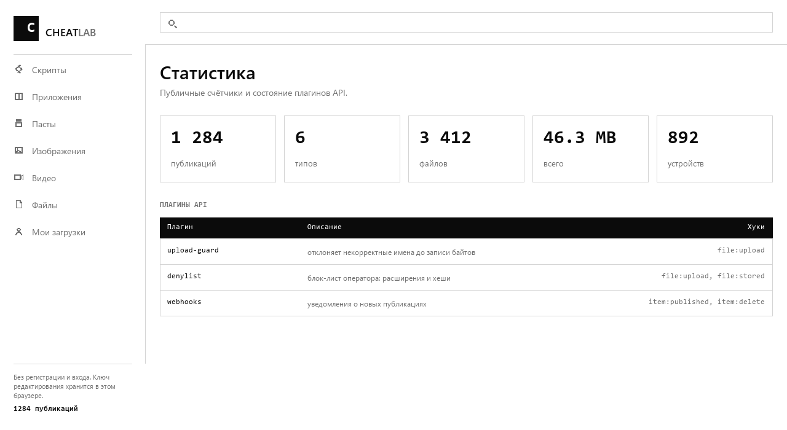

<p align="center">
  
</p>

# CHEATLAB

Анонимная площадка для публикации **скриптов, кода, изображений, видео и любых
файлов**. Без регистрации, без входа, без OAuth и без внешних сервисов: браузер
сам генерирует идентификатор устройства, API выдаёт ключ редактирования при
публикации, и больше ничего не требуется.

Чёрно-белый интерфейс: один акцент — чёрный, никаких градиентов, скруглений и
эмодзи, только линейные иконки.

Размещено бесплатно: статика на **GitHub Pages**, API на **Cloudflare Workers**,
метаданные в **D1**, байты в **KV**. Ноль зависимостей во фронтенде, ноль
зависимостей в Worker, ноль привязки карты — KV входит в бесплатный тариф, а R2
пришлось бы включать в панели через оплату.

| | |
| --- | --- |
|  |  |
|  |  |

---

## Что умеет

- Шесть типов публикаций: скрипт, приложение, паста, изображение, видео, файл.
- Файлы адресуются по содержимому: два одинаковых файла занимают место один раз.
- Изображения показываются в ленте и на странице публикации с подписью и
  кнопкой скачивания.
- Видео отдаётся с поддержкой `Range` и перемотки, аудио — плеером.
- Просмотр исходника, скачивание, счётчик просмотров, теги, поиск, сортировка.
- Публикация под ключом: тело, превью и список файлов не отдаются до верного
  ключа, при этом заголовок, теги, счётчики и подсказка остаются видны, чтобы
  было понятно, что человек собирается открыть.
- Ключ доступа хранится только как хеш, показывается один раз при публикации и
  живёт в браузере отдельно от ключа редактирования — экспорт одного не тянет за
  собой права на запись.
- Лайки, подписки и просмотры; просмотр считается один раз на браузер и не
  засчитывается автору, даже если он вошёл с другого устройства.
- Аккаунты с паролем: сессия привязана к браузеру, четыре публикации в сутки и
  публикация без проверки. Пароль хранится как PBKDF2-HMAC-SHA256 со 100 000
  итераций — это потолок рантайма Workers: `crypto.subtle.deriveBits` отклоняет
  большее число и роняет регистрацию и вход в 500. Число хранится в строке
  пользователя, поэтому его можно поднять позже, не ломая чужие пароли.
- Профиль: описание, аватар, акцентный цвет и фон — санитайзерятся на сервере.
  Фон принимает цвет и градиент по белому списку символов; `url()` и вторая
  декларация отбрасываются, поэтому подставить свою загрузку нельзя.
- Значок администратора выдаётся сервером по списку `ADMIN_IDS` и не может быть
  присвоен клиентом.
- Свои публикации на странице «Мои загрузки», экспорт и импорт ключей.
- Виджет `embed.js` для встраивания в чужие сайты.
- Никаких гейтов: страна, ASN, VPN и тип подключения не влияют на доступ.

---

## Архитектура

```
public/                статика для GitHub Pages (vanilla, без сборки)
  index.html           разметка и спрайт иконок
  app.js               SPA: роуты, формы, лента, публикация
  style.css            чёрно-белая тема
  embed.js             виджет для чужих сайтов
  og.png               превью для ссылок

worker/                Cloudflare Worker — единственный бэкенд
  src/index.js         маршруты, CORS, лимиты, Range
  src/store.js         D1: items, files, clients, rate
  src/blobs.js         KV: байты по SHA-256, дедупликация
  src/plugins.js       хост плагинов
  src/util.js          id, секреты, хеши, mime, имена файлов
  plugins/             upload-guard, denylist, webhooks
  schema.sql           схема D1
  migrations/          миграции для wrangler d1 execute
  test/                583 проверок на локальных шимах D1 и KV

scripts/set-api-url.mjs   вписывает адрес Worker в public/index.html
tools/screens.py          рисует og.png и скриншоты из docs/
```

Фронтенд не знает, где живёт API: он читает `<meta name="cheatlab-api">` в
`public/index.html`. Пустое значение означает «тот же origin», поэтому сайт
работает и локально, и за прокси, который раздаёт всё с одного хоста.

---

## Развёртывание

### 1. API

```bash
cd worker
npm install

npx wrangler login
npx wrangler d1 create cheatlab          # вписать database_id в wrangler.toml
npx wrangler kv namespace create BLOBS   # вписать id в wrangler.toml

npx wrangler d1 execute cheatlab --remote --file=./migrations/0001_init.sql
npx wrangler deploy --config wrangler.toml
```

`wrangler.toml` содержит два места для ручной правки:

```toml
[[d1_databases]]
database_name = "cheatlab"
database_id   = "REPLACE_WITH_D1_DATABASE_ID"   # ← из вывода wrangler d1 create

[[kv_namespaces]]
binding = "BUCKET"
id       = "REPLACE_WITH_KV_NAMESPACE_ID"       # ← из вывода wrangler kv namespace create
```

> `--config wrangler.toml` указан не по привычке: если в родительских каталогах
> лежит чужой `wrangler.jsonc`, wrangler подхватит его вместо вашего конфига и
> упадёт на чужом `name`. Флаг фиксирует, какой файл читать.

Настройки (все — обычные `vars`, секретов нет):

| Переменная | По умолчанию | Назначение |
| --- | --- | --- |
| `SITE_URL` | `https://tatarhost.github.io/cheatlab` | куда `PLUGINS` и ссылки ведут на этот хост |
| `ALLOW_ORIGIN` | `*` | значение `Access-Control-Allow-Origin` |
| `MAX_FILE_MB` | `24` | лимит одного файла; потолок KV — 25 МиБ на значение |
| `MAX_TEXT_KB` | `256` | лимит текста публикации |
| `MAX_FILES` | `20` | файлов на публикацию |
| `MAX_WRITE_RPM` | `30` | записей в минуту на устройство |
| `MAX_READ_RPM` | `240` | чтений в минуту |
| `CL_DENY_EXT` | — | `exe,scr,vbs` — запретить расширения |
| `CL_DENY_SHA` | — | список SHA-256 для блокировки |
| `CL_WEBHOOK_URL` | — | адрес для уведомлений о публикациях |
| `ADMIN_IDS` | — | список ID пользователей, которые будут отмечены админом (через запятую) |

### 2. Сайт

```bash
node scripts/set-api-url.mjs https://cheatlab.<ваш-поддомен>.workers.dev
git commit -am "point the site at the deployed API"
git push
```

Дальше срабатывает `.github/workflows/pages.yml`: он публикует каталог
`public/` через `actions/deploy-pages`. API при этом не трогается — он живёт в
Cloudflare.

Чтобы стереть адрес и вернуть same-origin:

```bash
node scripts/set-api-url.mjs
```

### Про поддомен и 404

Сайт живёт на `https://tatarhost.github.io/cheatlab/`, а не в корне домена.
Поэтому в `public/index.html` есть `<base href="/cheatlab/">`, а `app.js`
читает его обратно и сам добавляет префикс к маршрутам. Переехали на свой домен
или в корень — удалите строку `<base>`, всё продолжит работать.

Глубокая ссылка вида `/cheatlab/i/a1b2c3d4` на GitHub Pages отдаётся со статусом
**404**, хотя тело страницы — рабочее приложение: Pages подставляет свой
`404.html` (workflow копирует в него `index.html`) и не умеет отдавать другой
код. В браузере это незаметно, но некоторые мессенджеры и превью-скрапперы
пропустят такую ссылку. Лечится либо своим доменом, либо hash-роутингом —
это осознанный размен чистых адресов на корректный статус.

### Бесплатно

Cloudflare Free-тариф покрывает эту нагрузку с запасом: 100 000 запросов
Workers в сутки, 5 млн строк чтения и 100 000 строк записи D1 в сутки, 5 ГБ
базы, 1 ГБ KV, 100 000 чтений и 1 000 записей KV в сутки. Исходящий трафик
Workers не тарифицируется — скачивание файлов и видео бесплатно.

---

## Идентичность без регистрации

1. При первом визите `app.js` генерирует 24 случайных байта, кладёт
   `cheatlab.client` в `localStorage` и отправляет их в заголовке
   `x-cheatlab-client` с каждым запросом.
2. Публикация возвращает `secret`. Он кладётся в `localStorage`
   (`cheatlab.keys`) и больше нигде не хранится: в базе лежит только
   `sha256(secret)`.
3. Изменение и удаление требуют `x-cheatlab-secret`. Чужой `client` без секрета
   не проходит.

Публичный API никогда не отдаёт `author` в исходном виде — только шестизначный
тег `sha256(id)[:6]`. Ключи можно экспортировать и импортировать на странице
«Мои загрузки», чтобы не потерять доступ при очистке данных браузера.

---

## API

Все ответы — JSON. Заголовок `x-cheatlab-client` обязателен для записи.

| Метод | Путь | Что делает |
| --- | --- | --- |
| `GET` | `/api/config` | типы, языки, лимиты, загруженные плагины |
| `GET` | `/api/stats` | счётчики хранилища |
| `GET` | `/api/plugins` | список серверных плагинов и их хуков |
| `GET` | `/api/items` | лента: `type`, `q`, `tag`, `author`, `sort`, `limit`, `offset` |
| `POST` | `/api/items` | создать; возвращает `{ item, secret, accessKey? }` |
| `GET` | `/api/items/:id` | публикация; вернёт `{ item, liked, isFollowing }` |
| `PATCH` | `/api/items/:id` | изменить; нужен `x-cheatlab-secret` |
| `DELETE` | `/api/items/:id` | удалить публикацию и её файлы |
| `POST` | `/api/items/:id/unlock` | проверить ключ; вернёт `{ unlocked }` |
| `POST` | `/api/items/:id/like` | поставить лайк, вернёт `{ liked, likes }` |
| `DELETE` | `/api/items/:id/like` | снять лайк |
| `GET` | `/api/users/:id` | профиль, его публикации и `isFollowing` |
| `POST` | `/api/users/:id/follow` | подписаться, вернёт `{ following }` |
| `DELETE` | `/api/users/:id/follow` | отписаться |
| `GET` | `/api/users/:id/followers` | кто на него подписан |
| `POST` | `/api/items/:id/files` | загрузить файл (нужен `x-cheatlab-client` автора) |
| `DELETE` | `/api/files/:id` | удалить файл |
| `GET` | `/api/me` | свои публикации и файлы |
| `GET` | `/f/:fileId` | скачать вложение (`Content-Disposition: attachment`) |
| `GET` | `/f/:fileId/raw` | открыть в браузере, поддерживает `Range` и `ETag` |
| `GET` | `/m/:itemId` | медиа публикации: изображение, видео или аудио целиком |
| `GET` | `/r/:itemId` | сырой текст без интерфейса |

`/m/:id` и `/f/:id/raw` отдают `206 Partial Content` на запрос с `Range`, так что
видео перематывается без загрузки целиком, и `304` при совпадении `ETag`.

### Публикация под ключом

Ключ доступа — это пароль на чтение, отдельный от ключа редактирования. На
создании передаётся `accessKey` и необязательная подсказка `keyHint`:

```bash
curl -X POST https://cheatlab.example.workers.dev/api/items \
  -H "x-cheatlab-client: <ваш client id>" \
  -H "content-type: application/json" \
  -d '{"type":"paste","title":"заметки","body":"...","accessKey":"secret","keyHint":"из профиля"}'
```

Ответ содержит `accessKey` ровно один раз: сервер хранит только хеш, поэтому
восстановить ключ нельзя, а потерянный приходится заменять новым через `PATCH`.

Дальше ключ передаётся одним из двух способов:

- `x-cheatlab-key: <ключ>` — для запросов из приложения;
- `?key=<ключ>` — для `/m`, `/f`, `/f/:id/raw` и `/r`, потому что ``,
  `<video>` и «открыть в новой вкладке» не умеют ставить заголовки.

Если ключ не совпал, `GET /api/items/:id` всё равно отдаёт `200` с оболочкой:
`title`, `tags`, счётчики, `locked: true` и `keyHint`, но без `body`, `preview`
и `files`. Медиа и файлы в этом случае отвечают `403`, а не `404`, чтобы по
коду ответа нельзя было отличить закрытую публикацию от несуществующей.

Лимит на перебор — 10 попыток в минуту на браузер.

### Загрузка файла

Тело запроса — сами байты, имя — в заголовке. Multipart не разбирается:

```bash
curl -X POST https://cheatlab.example.workers.dev/api/items/abc12345/files \
  -H "x-cheatlab-client: <ваш client id>" \
  -H "x-filename: aimbot.lua" \
  --data-binary @aimbot.lua
```

Имя кодируется в URL-безопасную строку, сервер декодирует и чистит. Размер
проверяется на лету: файл больше лимита не пишется в KV целиком.

Пример создания пасты:

```bash
curl -X POST https://cheatlab.example.workers.dev/api/items \
  -H "content-type: application/json" \
  -H "x-cheatlab-client: <ваш client id>" \
  -d '{"type":"paste","title":"хоткейы","body":"F6 — toggle"}'
```

`GET /api/*` отдаётся с `Access-Control-Allow-Origin: *` и отвечает на
`OPTIONS`, поэтому API можно дёргать с любой страницы.

---

## Серверные плагины

Плагин — модуль в `worker/plugins/`, зарегистрированный в `worker/src/plugins.js`.
Динамического `import()` по имени файла в Workers нет, поэтому список статический:

```js
export default {
  name: 'my-plugin',
  description: 'что делает',
  hooks: {
    async 'file:upload'(file, ctx) {
      if (file.size > 1e9) throw reject('слишком большой');
      return { ...file, mime: 'application/octet-stream' };
    },
  },
};
```

| Хук | Когда | Значение |
| --- | --- | --- |
| `item:create` | перед записью в базу | черновик публикации; `throw reject()` → 422 |
| `item:published` | после создания | публичное представление |
| `item:update` | после PATCH | публичное представление |
| `item:delete` | после удаления | публичное представление |
| `file:upload` | **до** записи байт в KV | `{ id, item_id, name, mime }` |
| `file:stored` | после записи | файл с `size` и `sha256`; `throw reject()` откатывает и строку, и объект |
| `file:delete` | после удаления | файл |

`reject(reason)` из `worker/src/plugins.js` помечает ошибку как намеренный отказ;
любая другая ошибка тоже превращается в отказ, но с пометкой `plugin error`.
Возвращённый объект заменяет значение для следующих плагинов. Хуки выполняются
в порядке регистрации. Ошибка в одном плагине не роняет запрос — все отказы
собираются в поле `reasons` ответа.

Что уже установлено:

- **upload-guard** — отсекает пустые имена, пути, управляющие символы и
  непригодные расширения. Любое расширение, которое можно осмысленно назвать,
  проходит: белого списка нет, политика живёт в denylist.
- **denylist** — расширения и хеши из `CL_DENY_EXT` / `CL_DENY_SHA`. По
  умолчанию пуст: решать, что блокировать, оператору, а не коду.
- **webhooks** — POST на `CL_WEBHOOK_URL` при публикации и удалении.

Список и хуки видны на `/stats` и `/api/plugins`.

---

## Плагин для сайтов: `embed.js`

Виджет публикации для любой страницы. Сборка, бэкенд и учётные записи не нужны:

```html
<div class="cheatlab-embed" data-title="Мой скрипт">код, который хочу опубликовать</div>
<script src="https://tatarhost.github.io/cheatlab/embed.js"
        data-api="https://cheatlab.example.workers.dev"
        data-site="https://tatarhost.github.io/cheatlab"
        data-language="luau"
        defer></script>
```

Атрибуты: `data-api` (обязателен), `data-site` (хост сайта, если он отличается
от API), `data-target` (селектор контейнера), `data-language`, `data-label`, а на
самом контейнере — `data-title` и `data-content` для предзаполнения. Виджет
берёт тот же `client id` из `localStorage`, сохраняет выданный ключ рядом с
ключами сайта и показывает ссылку на публикацию.

---

## Хранилище

Файлы адресуются по содержимому: ключ KV — `blobs/<aa>/<bb>/<sha256>`. Одинаковые
байты хранятся один раз, удаление публикации убирает объект, только если на эти
байты не ссылается больше ни одна строка.

Если понадобится другое хранилище, реализуйте те же четыре метода, что у
`BlobStore` в `worker/src/blobs.js`:

```js
put(readable, maxBytes)   // -> { sha, size, deduped }
get(sha, range)           // -> ReadableStream
head(sha)                 // -> { size, etag } | null
remove(sha)
```

База при этом остаётся D1.

### Резервная копия

У D1 есть встроенный **Time Travel** — 30 дней истории, откат в пару кликов и без
выгрузки:

```bash
# откатить метаданные на момент в прошлом (принимает unix-время или RFC3339)
npx wrangler d1 time-travel restore cheatlab --timestamp=2026-09-01T08:46:42Z
```

Для переносимой копии — обычный дамп:

```bash
npx wrangler d1 export cheatlab --remote --output backup.sql
```

Файлы в KV. У wrangler есть только точечные операции над ключом
(`kv key put/get/delete`), массовой выгрузки нет, поэтому для переносимой копии
нужен дамп по диапазону префиксов: имена байтов выводятся из D1-колонки `sha256`
у таблицы `file`, а сами значения забираются ключ за ключом.

Восстановление: создать пустой D1, выполнить `backup.sql`, затем вернуть ключи
`blobs/<aa>/<bb>/<sha256>` в KV с прежними значениями. Благодаря адресации по
содержимому порядок не важен.

---

## Тесты

```bash
cd worker
npm test
```

Четыре набора, все на локальных шимах: D1 эмулируется через `node:sqlite`, KV —
через in-memory binding с поддержкой `Range`.

| набор | что проверяет |
| --- | --- |
| `test/worker.test.mjs` | медиа, Range, плагины, лимиты |
| `test/auth.test.mjs` | регистрация, PoW, сессии, квоты |
| `test/client.test.mjs` | контракт, который читает `public/app.js`: заголовки, preflight, поля ответов, поток ленты и публикации |
| `test/views.e2e.mjs` | сам `public/app.js` целиком: реальный Worker отдаёт реальный JSON, вью собирают из него DOM |

Последний набор важен отдельно: `node --check` не ловит `ReferenceError` внутри
вью, а падение при рендере выглядит как обычная страница 404. Поэтому здесь
каждый маршрут загружается настоящим ответом API, и проверяется, что он
показал своё содержимое, а не «страница не найдена». Кнопки и формы в нём
настоящие: `addEventListener` запоминает обработчики, поэтому импорт ключей и
экран блокировки проверяются кликом и отправкой формы, а не только рендером.

Реальный Cloudflare runtime проверяется только деплоем; тесты ловят логику,
маршруты и дедупликацию, но не поведение платформы.

---

## Что ограничено, а что нет

Не ограничено: страна, ASN, VPN, тип подключения, репутация IP. Запросы
проходят одинаково откуда угодно, включая мобильные операторы и приватные VPN.

Ограничено: частота записи (30 в минуту на устройство), частота чтения
(240 в минуту), размер файла, размер текста, число файлов на публикацию,
структура имени файла и то, что разрешают плагины.

---

Иконки — [Lucide](https://lucide.dev) 1.38.0, лицензия ISC; геометрия перенесена
в спрайт `public/index.html`, поэтому внешних загрузок нет и строгая CSP не
нарушается.
